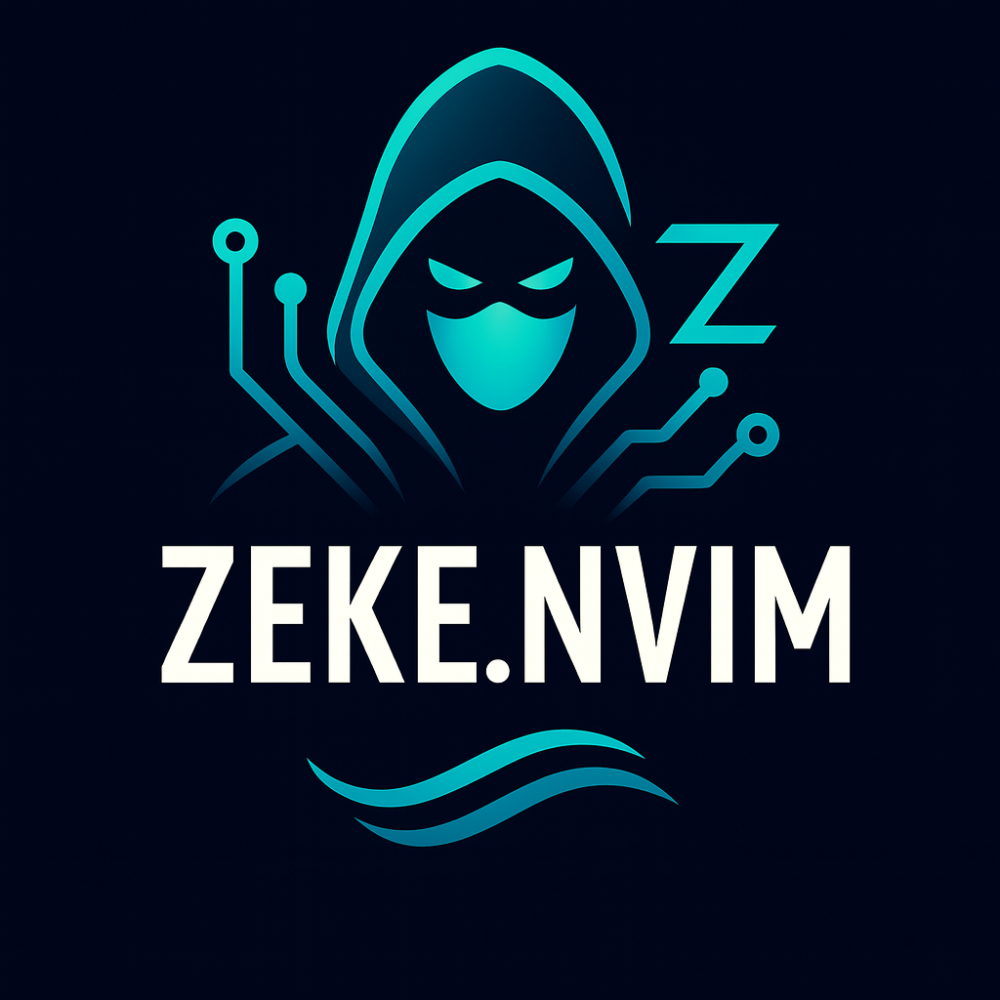

<div align="center">
  
  <h1>zeke.nvim</h1>
</div>

[](https://www.rust-lang.org/)
[](https://neovim.io/)
[](https://opensource.org/licenses/MIT)
[](https://github.com/ghostkellz/zeke.nvim/releases)
[](https://github.com/ghostkellz/zeke.nvim/stargazers)

A powerful Neovim plugin for the Zeke AI platform - your Claude Code alternative, built with Rust for blazing-fast performance.

## ✨ Features

- 🤖 **Multiple AI Providers**: OpenAI, Claude, GitHub Copilot, Ollama
- ⚡ **Rust Performance**: Native speed with mlua bindings
- 💬 **Interactive Chat UI**: Floating window with conversation history
- 📁 **Workspace Context**: File tree integration and project awareness
- 🔍 **Smart Search**: Workspace file indexing and fuzzy search
- 📝 **Intelligent Editing**: Context-aware code editing with diff preview
- 🔧 **Diff View**: Visual code change review with accept/reject
- 🌊 **Streaming Support**: Real-time streaming responses
- 📚 **Context Management**: Multi-file context with smart prompting
- 🎯 **Code Analysis**: Quality, performance, and security analysis
- 📦 **Task Management**: Background processing and cancellation
- 🔧 **Highly Configurable**: Extensive customization options

## 📦 Installation

### Using [lazy.nvim](https://github.com/folke/lazy.nvim)

```lua
{
  "ghostkellz/zeke.nvim",
  build = "cargo build --release",
  dependencies = {
    "nvim-lua/plenary.nvim",
  },
  config = function()
    require("zeke").setup({
      -- your configuration
    })
  end,
}
```


### Using [packer.nvim](https://github.com/wbthomason/packer.nvim)

```lua
use {
  'ghostkellz/zeke.nvim',
  run = 'cargo build --release',
  requires = { 'nvim-lua/plenary.nvim' },
  config = function()
    require('zeke').setup({
      -- your configuration
    })
  end
}
```


## 📋 Requirements

- Neovim 0.9+
- Rust 2024 edition
- Cargo (Rust package manager)
- API keys for AI providers (OpenAI/Claude/GitHub)

## ⚙️ Configuration

```lua
require('zeke').setup({
  -- API Keys (can also use environment variables)
  api_keys = {
    openai = vim.env.OPENAI_API_KEY,
    claude = vim.env.ANTHROPIC_API_KEY,
    copilot = vim.env.GITHUB_TOKEN,
  },

  -- Default provider and model
  default_provider = 'openai',  -- 'openai', 'claude', 'copilot', 'ollama'
  default_model = 'gpt-4',

  -- Generation parameters
  temperature = 0.7,
  max_tokens = 2048,
  stream = false,

  -- UI settings
  auto_reload = true,

  -- Keymaps
  keymaps = {
    chat = '<leader>zc',
    edit = '<leader>ze',
    explain = '<leader>zx',
    create = '<leader>zn',
    analyze = '<leader>za',
    models = '<leader>zm',
    tasks = '<leader>zt',
    chat_stream = '<leader>zs',
  },

  -- Server configuration
  server = {
    host = '127.0.0.1',
    port = 7777,
    auto_start = true,
  },
})
```

## 🎮 Commands

### Core AI Commands
| Command | Description |
|---------|-------------|
| `:ZekeChat [message]` | Chat with AI (opens floating UI if no message) |
| `:ZekeEdit [instruction]` | Edit current buffer with AI (shows diff) |
| `:ZekeExplain` | Explain current buffer code |
| `:ZekeCreate [description]` | Create new file with AI |
| `:ZekeAnalyze [type]` | Analyze code (quality/performance/security) |
| `:ZekeChatStream [message]` | Streaming chat |

### UI & Chat Commands
| Command | Description |
|---------|-------------|
| `:ZekeToggleChat` | Toggle floating chat window |
| `:ZekeSaveConversation` | Save current conversation to history |
| `:ZekeLoadConversation` | Load conversation from history |

### Context Management
| Command | Description |
|---------|-------------|
| `:ZekeAddFile` | Add file to context (with picker) |
| `:ZekeAddCurrent` | Add current file to context |
| `:ZekeAddSelection` | Add current selection to context |
| `:ZekeShowContext` | Show context summary |
| `:ZekeClearContext` | Clear all context |
| `:ZekeContextFiles` | Show and manage context files |
| `:ZekeSearch [query]` | Search workspace files |

### Model & Provider Management
| Command | Description |
|---------|-------------|
| `:ZekeModels` | List available models |
| `:ZekeSetModel [model]` | Set active model |
| `:ZekeCurrentModel` | Show current model |
| `:ZekeSetProvider [provider]` | Switch AI provider |

### Task Management
| Command | Description |
|---------|-------------|
| `:ZekeTasks` | List active tasks |
| `:ZekeCancelTask [id]` | Cancel specific task |
| `:ZekeCancelAll` | Cancel all tasks |

## 🔑 Default Keymaps

| Keymap | Action |
|--------|--------|
| `<leader>zc` | Chat with AI |
| `<leader>ze` | Edit buffer |
| `<leader>zx` | Explain code |
| `<leader>zn` | Create new file |
| `<leader>za` | Analyze code |
| `<leader>zm` | List models |
| `<leader>zt` | List tasks |
| `<leader>zs` | Streaming chat |

## 🌍 Environment Variables

Set these environment variables for API access:

```bash
export OPENAI_API_KEY="sk-..."
export ANTHROPIC_API_KEY="..."
export GITHUB_TOKEN="ghp_..."
export OLLAMA_HOST="http://localhost:11434"  # Optional, defaults to this
```

## 🛠️ Building from Source

```bash
# Clone the repository
git clone https://github.com/ghostkellz/zeke.nvim.git
cd zeke.nvim

# Build the Rust library
cargo build --release

# The compiled library will be at:
# target/release/libzeke_nvim.so (Linux)
# target/release/libzeke_nvim.dylib (macOS)
# target/release/zeke_nvim.dll (Windows)
```

## 📚 API Usage

```lua
local zeke = require('zeke')

-- Core AI functions
zeke.chat("Explain async/await in Rust")
zeke.edit("Add error handling to this function")
zeke.explain()
zeke.create("REST API client in Rust")
zeke.analyze('security')

-- UI functions
zeke.toggle_chat()
zeke.save_conversation()
zeke.list_conversations()

-- Context management
zeke.add_current_file_to_context()
zeke.add_selection_to_context()
zeke.show_context()
zeke.clear_context()
zeke.workspace_search("config")

-- Provider management
zeke.set_provider('ollama')
zeke.list_models()
zeke.set_model('llama2')
zeke.get_current_model()

-- Task management
zeke.list_tasks()
zeke.cancel_task(1)
zeke.cancel_all_tasks()
```

## 🏗️ Architecture

```
zeke.nvim/
├── src/                 # Rust source code
│   ├── lib.rs          # Main library entry point
│   ├── ai.rs           # AI utilities
│   ├── config.rs       # Configuration handling
│   ├── providers/      # AI provider implementations
│   │   ├── openai.rs
│   │   ├── claude.rs
│   │   └── copilot.rs
│   ├── streaming.rs    # Streaming support
│   └── terminal.rs     # Terminal/task management
├── lua/                # Lua plugin code
│   └── zeke/
│       ├── init.lua    # Plugin entry point
│       ├── config.lua  # Configuration
│       ├── commands.lua # Command implementations
│       └── terminal.lua # Terminal UI
├── plugin/             # Neovim plugin files
│   └── zeke.lua       # Auto-loaded commands
└── Cargo.toml         # Rust dependencies
```

## 🤝 Contributing

Contributions are welcome! Please feel free to submit a Pull Request.

1. Fork the repository
2. Create your feature branch (`git checkout -b feature/amazing-feature`)
3. Commit your changes (`git commit -m 'Add some amazing feature'`)
4. Push to the branch (`git push origin feature/amazing-feature`)
5. Open a Pull Request

## 📄 License

This project is licensed under the MIT License - see the [LICENSE](LICENSE) file for details.

## 🙏 Acknowledgments

- Built with [mlua](https://github.com/khvzak/mlua) for Lua bindings
- Inspired by [claude-code.nvim](https://github.com/anthropics/claude-code.nvim)
- Part of the [Zeke AI Platform](https://github.com/ghostkellz/zeke)

## 📞 Support

- Report issues on [GitHub Issues](https://github.com/ghostkellz/zeke.nvim/issues)
- Join our [Discord](https://discord.gg/zeke) community
- Email: ckelley@ghostkellz.sh

---

Made with ❤️ by Christopher Kelley
